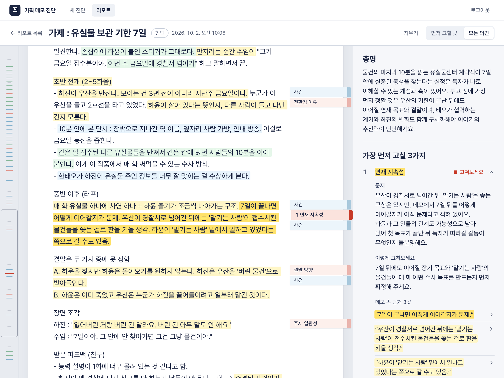
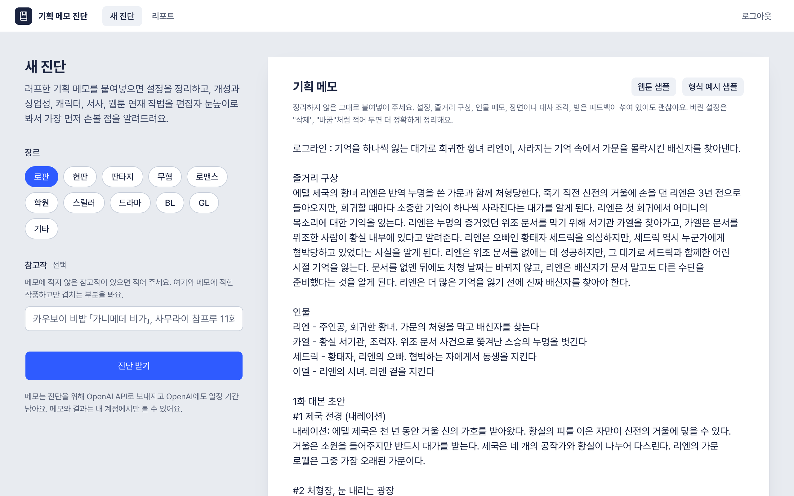

# 기획 메모 진단

웹툰·만화 작가가 정리하지 않은 기획 메모를 그대로 붙여넣으면, 편집자 눈높이로 읽고 **가장 먼저 고칠 3가지**를 메모 속 문장을 근거로 짚어 주는 웹 도구다. 공모전이나 플랫폼 투고를 준비하는 지망생이 투고 전에 기획을 점검하는 데 쓴다.

- 둘러보기: <https://side-project-gamma.vercel.app/demo> (로그인 없이 예시 리포트 하나를 본다. 진단 실행과 삭제는 막혀 있다)
- 직접 쓰기: <https://side-project-gamma.vercel.app> (이메일만 있으면 가입한다)



리포트 화면이다. 왼쪽은 작가가 쓴 메모 원문이고, 의견의 근거가 된 문장에 형광펜이 칠해진다. 오른쪽은 총평과 가장 먼저 고칠 3가지다. 의견을 누르면 원문의 근거 문장으로 이동한다.

## 왜 만들었나

한 사람의 요청에서 시작했다. 플랫폼과 에이전시 투고를 준비하던 웹툰 작가 지망생이 투고 전에 설정 정리, 상업성, 캐릭터, 작법을 점검받고 싶어 했다. 그 요청을 풀면서 마주친 문제는 세 가지다.

- **기획 메모는 러프하다.** 설정, 줄거리 구상, 인물 메모, 장면과 대사 조각, 받은 피드백과 수정안이 한 파일에 섞이고 버전이 여러 개 겹친다. 쓴 사람도 무엇이 최종안인지, 어디가 서로 어긋나는지 놓치기 쉽다.
- **투고 전에는 편집자의 의견을 듣기 어렵다.** 지망생은 작품이 얼마나 개성 있고 팔릴 만한지, 무엇부터 고쳐야 하는지를 스스로 판단해야 한다.
- **AI에게 그냥 물으면 믿고 고치기 어렵다.** 메모에 없는 문장을 근거로 대거나, 어디를 말하는지 알 수 없는 조언을 하거나, 설정과 줄거리를 대신 써 버린다.

그래서 이 도구는 메모를 정리하지 않은 그대로 받고, 판단마다 메모 속 문장을 근거로 붙이고, 고칠 방향만 짚는다.

### 쓰는 사람의 경험을 기준으로 고친 것

만드는 동안 쓰는 사람이 겪는 불편을 기준으로 여러 번 고쳤다. 고치기 전과 지금은 이렇게 다르다.

| 쓰는 사람이 겪는 것 | 고치기 전 | 지금 |
| --- | --- | --- |
| 무엇을 봐 주나 | 주로 내용이 적혀 있는지를 확인하는 질문 13개였다. 요청한 사람이 원한 것은 이야기가 얼마나 잘 짜였는지에 대한 평가였다. | 독자를 붙잡기에 충분한지까지 편집자 눈높이로 보는 질문 23개다. 장르 재미, 개성, 셀링 포인트, 주인공 매력, 웹툰 연재 작법을 더했다. |
| 누가 진단하나 | 만든 사람의 맥에서만 진단했다. 요청한 사람은 저장된 리포트만 볼 수 있었다. | 누구나 이메일로 가입해 웹에서 직접 진단하고, 자기 리포트만 본다. |
| 얼마나 기다리나 | 한 번에 약 12분이었다(합성 메모 중앙값 737초). | 약 5분이다(중앙값 305초, 다시 잰 24건은 266초). 창을 닫아도 진단은 계속되고 다시 열면 이어받는다. |
| 리포트를 어떻게 읽나 | 의견 카드에 인용문을 옮겨 적어 보여 줬다. | 메모 원문에 형광펜과 여백 색인을 붙였다. 의견을 누르면 근거 문장으로, 색인을 누르면 의견으로 이동한다. |

## 무엇을 해 주나

### 쓰는 순서

1. 장르를 고르고 기획 메모를 붙여넣는다(최대 4만 자). 메모에 적지 않은 참고작이 있으면 따로 적는다.
2. **진단 받기**를 누른다. 보통 6분쯤 걸린다. 창을 닫아도 진단은 계속되고, 같은 브라우저에서 새 진단 화면을 다시 열면 결과를 이어받는다.
3. 리포트를 읽는다. 리포트는 계정에 저장되고 만든 사람만 본다.



### 리포트 구성

| 순서 | 내용 |
| --- | --- |
| 총평 | 이 작품의 개성과 팔릴 만한 점, 가장 큰 약점을 한두 문장으로 |
| 가장 먼저 고칠 3가지 | 항목마다 무엇이 문제인지, 어떻게 고쳐 볼지, 메모 속 근거 문장 |
| 이런 점이 좋아요 | 개성이나 상업적 매력이 드러나는 장점 2~3개 |
| 설정 정리 | 인물, 세계 규칙, 사건 순서, 어긋나는 설정, 버리거나 바꾼 설정 |
| 항목별 신호등 | 22개 항목을 좋아요·조금 더·고쳐보세요로 표시. 펼치면 질문별 답과 이유 |
| 참고작과 겹치는 부분 | 작가가 적은 참고작마다 겹쳐 보이는 요소 |

원문 쪽에는 근거 문장마다 형광펜이 칠해지고 여백에 의견 색인이 붙는다. 색인을 누르면 의견으로, 의견을 누르면 근거 문장으로 이동한다. 위쪽 스위치로 먼저 고칠 곳만 볼지 모든 의견을 볼지 고른다. 휴대폰에서는 의견이 아래에서 올라오는 창으로 열린다.

### 진단 항목

| 축 | 항목 |
| --- | --- |
| 설정 | 설정 일관성, 핵심 규칙, 버전 정리 |
| 상업성 | 로그라인 훅, 연재 지속성, 장르 재미, 개성, 셀링 포인트 |
| 캐릭터 | 욕망과 결핍, 행동 동기, 조연 역할, 주인공 매력, 인물 변화 |
| 서사 | 중심 질문, 갈등의 크기, 전환점 이유, 결말 방향, 주제 일관성 |
| 웹툰 연재 | 첫 화 사건, 초반 전개, 회차 끝 긴장, 설명 분산 |

항목마다 "예"가 좋은 답인 질문이 있다(22개 항목, 23개 질문, `src/lib/diagnosis/items.ts`). 질문이 모두 "예"면 좋아요, 일부만 "예"면 조금 더, 하나도 없으면 고쳐보세요다. 질문과 신호등 규칙은 검증되지 않은 초안이다.

### 지키는 규칙

- 진단 결과는 합격 확률 같은 숫자가 아니라 신호등과 근거(메모 속 문장 인용)로 보여준다.
- 모델이 붙인 인용은 코드에서 메모 원문과 대조하고, 원문에 없는 인용은 버린다. 근거가 모두 버려진 "예" 답은 "아니오"로 바꾼다(`src/lib/diagnosis/rules.ts`).
- 설정이나 줄거리를 대신 지어주지 않고, 문제와 방향만 짚는다.
- 작가가 버리거나 바꿨다고 적은 설정은 최종안으로 보지 않는다.
- 표절은 판정하지 않는다. 작가가 직접 적은 참고작과 겹치는 부분만 참고로 보여준다.
- 개성과 장르 재미는 작품 데이터와 비교한 결과가 아니라, 모델이 장르의 흔한 설정 유형(회귀, 빙의 등)을 기준으로 판단한 것이다. 다른 작품 이름은 대지 않는다.
- 메모는 진단을 위해 OpenAI API로 보내지고 OpenAI에 일정 기간 보관된다.

## 쓰면 좋은 점

- **정리하지 않고 바로 넣는다.** 진단을 받으려고 기획서를 따로 다듬지 않아도 된다. 폐기안과 받은 피드백이 섞여 있어도 된다.
- **무엇부터 고칠지 정해 준다.** 22개 항목을 나열하고 끝내지 않고 먼저 고칠 3가지를 뽑는다.
- **근거를 직접 확인한다.** 의견마다 메모의 어느 문장을 보고 한 말인지 표시되므로, 받아들일지 말지를 작가가 판단할 수 있다.
- **흩어진 설정이 한곳에 모인다.** 인물, 세계 규칙, 사건 순서와 함께 어긋나는 설정, 버린 설정이 정리된다.
- **작품이 작가의 것으로 남는다.** 문제와 방향만 짚고 설정, 줄거리, 대사를 대신 쓰지 않는다.
- **싸고 기다릴 만하다.** 1회 약 $0.02, 보통 6분이다.

## 기대 효과

실제 작가를 대상으로 효과를 재지는 않았다. 아래는 기대하는 것이다.

- 설정 충돌, 동기 공백, 정해지지 않은 결말 같은 기본 결함을 투고 전에 스스로 잡는다.
- 고칠 곳이 3가지로 좁혀져, 다음 퇴고에서 무엇을 할지 바로 정할 수 있다.
- 강사, 동료, 편집자에게 보여 주기 전에 기본을 정리해 두어, 사람에게 받는 피드백을 더 깊은 이야기에 쓴다.

## 성능

판정 품질, 같은 메모를 다시 넣었을 때의 일관성, 소요 시간, 비용을 합성 메모로 쟀고, 화면이 뜨는 속도도 쟀다. **실제 작가 메모로는 아직 재지 않았다.** 기준은 [eval/CRITERIA.md](eval/CRITERIA.md), 실행 방법은 [eval/README.md](eval/README.md), 결과 분석은 [eval/LUNA-2026-10-01.md](eval/LUNA-2026-10-01.md)에 있다. 같은 메모를 3회씩 다시 잰 결과는 [eval/LUNA-2026-10-02-repeat.md](eval/LUNA-2026-10-02-repeat.md), 웹 성능은 [eval/WEB-2026-10-02.md](eval/WEB-2026-10-02.md)에 있다.

### 잰 방법

기획 메모 8개를 4쌍으로 만들었다. 각 쌍의 A는 문제가 없는 메모이고, B는 A에 결함 하나를 심은 메모다(설정 충돌, 동기 문장 삭제, 폐기안 표시 삭제, 결말 삭제). 앱과 같은 진단 경로로 메모마다 1회씩 진단해서, 심은 결함을 찾는지와 멀쩡한 대목을 문제 삼지 않는지를 봤다. 하나의 정확도 수치로 합치지 않고 범주별로 따로 센다.

### 결과

| 본 것 | Claude Opus 5.5 (추론 max) | gpt-6-luna (추론 high) | **gpt-6-luna (추론 max, 배포 중)** |
| --- | --- | --- | --- |
| 소요 시간 중앙값 | 737초 | 95초 | **305초** |
| 1회 비용(표준 요금) | 기록 없음(구독) | $0.006 | **$0.020** |
| 심은 결함을 문제로 판정 | 3건 중 3 | 3건 중 2 | **3건 중 3** |
| 지운 내용을 문제로 판정 | 2건 중 1 | 2건 중 2 | **2건 중 2** |
| 문제 없는 대목을 통과 | 5건 중 5 | 5건 중 4 | **5건 중 4** |
| 정해 둔 근거 문장까지 인용 | 6건 중 4 | 6건 중 2 | **6건 중 2** |
| 하면 안 되는 지적 | 10건 중 0 | 10건 중 0 | **10건 중 2** |
| 원문에 없는 인용 | 786개 중 0 | 606개 중 3 | **728개 중 1** |
| 바꾸지 않은 질문의 답이 쌍 사이에서 달라짐 | 78개 중 6 | 78개 중 8 | **78개 중 3** |

지금 배포한 설정(gpt-6-luna, 추론 max, 2026-10-01 측정)을 풀어 쓰면 이렇다.

- 8건 모두 성공했다. 모델 호출 실패, 후처리 실패, 질문 누락이 없었다.
- 6건은 259~322초에 끝났고 2건은 약 20분이 걸렸다. 비용은 1회 평균 $0.020, 최대 $0.022다.
- 원문에 없는 인용 1개는 앱이 걸러서 화면에 나오지 않았다.
- '정해 둔 근거 문장까지 인용'에서 빠진 4건은 문제라고 판정은 했지만 근거 인용이 모자랐던 경우다.
- 미리 정한 관문 5개 중 3개를 통과했고 2개(정해 둔 근거 인용 3건 이상, 하면 안 되는 지적 1건 이하)는 통과하지 못했다. 이 결과를 확인한 뒤 추론 max로 배포하기로 정했다.
- 판정 프롬프트, 규칙, 질문은 이 측정 뒤로 바뀌지 않았다.

Claude 기준선은 작성자 맥의 Claude Code 구독으로 돌린 것이라, 여러 사람이 쓰는 웹에서는 OpenAI API를 쓴다.

### 같은 메모를 다시 넣으면

배포 설정으로 같은 합성 메모 8개를 3회씩 다시 진단했다(2026-10-02, 24건 모두 성공).

- 같은 메모에서도 23개 질문 중 2~5개의 답이 실행마다 달라졌다. 메모 8개 × 질문 23개 = 184개 답 가운데 22개다.
- 흔들림은 일부 질문에 몰려 있다. 23개 질문 중 14개는 한 번도 갈리지 않았고, 회차 끝 긴장, 설명 분산, 설정 일관성, 버전 정리, 갈등의 크기에서 주로 갈렸다. 갈린 22개 중 18개는 같은 문장을 근거로 들고도 판정이 달랐다.
- 심은 결함 3건과 지운 내용 2건은 3회 모두 문제로 판정했다. 정답을 정해 둔 질문 10건 중 9건은 3회 모두 같은 답이었다.
- 가장 먼저 고칠 3가지가 3회 모두 같았던 메모는 8개 중 2개다.
- 미리 정한 관문 5개를 모두 통과한 회차는 없었다. 1·2회차는 하면 안 되는 지적(3건)에서, 3회차는 문제 없는 대목 통과(5건 중 3건)에서 걸렸다.
- 소요 시간 중앙값은 266초, 비용은 1회 평균 $0.019다. 24건 중 1건이 약 20분 걸렸다.

### 읽을 때 주의할 점

- 메모는 AI가 쓴 합성 메모이고 928~1,341자로 짧다. 수천~수만 자인 실제 메모의 성능을 대표하지 않는다.
- 정답 라벨은 AI가 쓴 임시 라벨이고 사람이 아직 검토하지 않았다.
- 결과 표는 조건마다 1회씩만 돌린 것이다. 배포 설정을 3회 더 돌려 보니 같은 조건에서도 값이 달라졌다(정해 둔 근거 인용 6건 중 3~4건, 하면 안 되는 지적 10건 중 1~3건). 그래서 표의 작은 차이를 모델 차이로 읽으면 안 된다. gpt-6-luna의 high와 max는 출력 스키마도 다르다.
- 개성, 장르 재미, 셀링 포인트, 주인공 매력 같은 주관 문항은 채점하지 않았다.

### 알려진 약점

평가에서 드러났고 아직 고치지 않은 것이다([eval/BASELINE-2026-09-30.md](eval/BASELINE-2026-09-30.md)의 F2, F3, F5와 [eval/LUNA-2026-10-02-repeat.md](eval/LUNA-2026-10-02-repeat.md)).

- 가장 먼저 고칠 3가지는 중요도 순이 아니다. 고쳐보세요 항목을 목록 순서대로 3개 자른다. 그래서 목록 뒤쪽 항목(예: 결말 방향)은 문제가 있어도 밀려날 수 있다.
- 메모에 없는 것과 메모 안에서 서로 어긋나는 것이 똑같이 고쳐보세요로 표시된다.
- 인용이 원문에 있는지만 확인하고, 그 인용이 판단을 실제로 뒷받침하는지는 확인하지 않는다.
- 버리거나 바꾼 설정이 없는 메모에서도 버전 정리가 고쳐보세요로 자주 나온다(18건 중 14건). 그때마다 가장 먼저 고칠 3가지에 들어갔다.
- 행동 동기는 24건 모두 고쳐보세요였다. 동기 문장이 적힌 메모와 지운 메모를 가르지 못한다.

### 웹 성능

로그인 없이 열리는 두 화면(로그인, 예시 리포트)을 Lighthouse로 3회씩 쟀다(2026-10-02).

- 화면이 멈추는 시간(TBT)은 7ms 이하, 화면이 밀리는 정도(CLS)는 0.085 이하로 12회 모두 낮았다.
- 가장 큰 내용이 뜨는 시간(LCP)의 데스크톱 중앙값은 로그인 0.5초, 예시 리포트 2.0초다.
- 모바일(느린 4G 가정)은 실행에 따라 LCP가 1.5초에서 13초까지 갈렸다. 전송량 2.2MB 중 2.0MB를 차지하는 폰트 파일 때문으로 보이며, 아직 고치지 않았다.

## 구조

- Next.js 16 (App Router, TypeScript, Tailwind CSS 4). 디자인 규칙은 [DESIGN.md](DESIGN.md).
- **진단**은 OpenAI Responses API(`gpt-6-luna`)를 background 모드로 부른다(`src/lib/llm.ts`). 서버는 작업을 맡기고 바로 응답하고, 브라우저가 10초마다 결과를 확인한다. 진행 중인 작업 번호는 브라우저에 보관해서, 창을 닫아도 같은 브라우저에서 이어받는다.
- **배포 앱(Vercel)** 에서는 누구나 가입해 진단하고, 자기가 만든 리포트만 본다. 진단 비용은 모든 사용자가 같은 OpenAI 크레딧에서 쓴다. 비용 상한은 OpenAI 선불 크레딧 잔액이다(자동 충전은 끈다). `APP_MODE=local`은 맥에서 로그인만 건너뛴다(`src/lib/env.ts`).
- DB는 Neon Postgres + Drizzle ORM(`src/db/`). 맥의 로컬 앱과 배포 앱이 같은 DB를 쓴다.
- 로그인은 이메일 링크(better-auth)이고 누구나 가입할 수 있다. 링크 요청은 10분에 3번으로 제한한다. 데이터 접근은 모두 `src/lib/dal.ts`에서 로그인을 확인한 뒤 하고, 리포트는 만든 사람에게만 보인다.

## 맥에서 실행

`.env.local`에 `OPENAI_API_KEY`가 있어야 한다.

```bash
bun install
cp .env.example .env.local   # DATABASE_URL, OWNER_EMAIL, OPENAI_API_KEY, APP_MODE=local 채우기
bun run db:migrate           # 처음 한 번, 테이블 만들기
bun run dev                  # 브라우저가 자동으로 열린다
```

로컬 앱은 `127.0.0.1`에서만 열리고 로그인 없이 작성자로 동작한다. 명령줄로 샘플을 진단하려면 `bun run diagnose -- samples/02-play-assignment.json`. 테스트는 `bun run test`로 돌린다(모델을 부르지 않는다).

## 배포 (Vercel)

1. Vercel에 저장소를 연결하고, Storage에서 Neon Postgres를 만들어 연결한다(`DATABASE_URL`이 자동으로 들어간다).
2. 환경변수: `OWNER_EMAIL`, `OPENAI_API_KEY`, `BETTER_AUTH_SECRET`(`openssl rand -base64 32`), `BETTER_AUTH_URL`(배포 주소), `SMTP_URL`, `SMTP_FROM`. `APP_MODE`는 넣지 않는다.
3. 맥의 `.env.local`에 같은 `DATABASE_URL`을 넣고 `bun run db:migrate`.

로그인 메일은 SMTP로 보낸다. Gmail 앱 비밀번호를 쓰면 누구에게나 보낼 수 있다(Resend 무료 발신 주소는 가입자 본인에게만 보낸다).

공유 주소는 `https://side-project-gamma.vercel.app`이다(`side-project-for-me13` 별칭은 Vercel 인증으로 막혀 있다).

로그인 없이 둘러보는 데모는 `https://side-project-gamma.vercel.app/demo`이다. 저장소에 든 예시 리포트 하나(`src/lib/demo-report.json`, 새로 쓴 기획 메모를 실제로 한 번 진단한 결과)를 보여주고, 진단 실행과 삭제는 막혀 있다.

## 설계 문서

- [기능 설계](https://claude.ai/code/artifact/fa81e68b-c6be-48c7-aa96-fff9fc7335de)
- [UI/UX 설계](https://claude.ai/code/artifact/476f5ce7-376b-4869-94cf-bb38d418c8a5)
